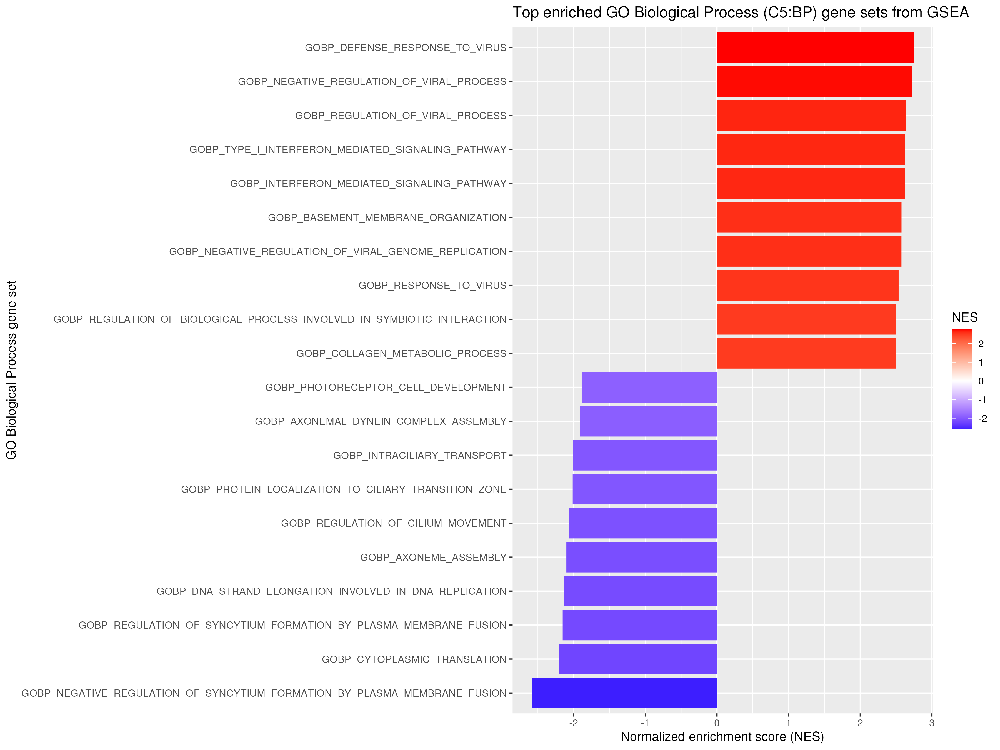
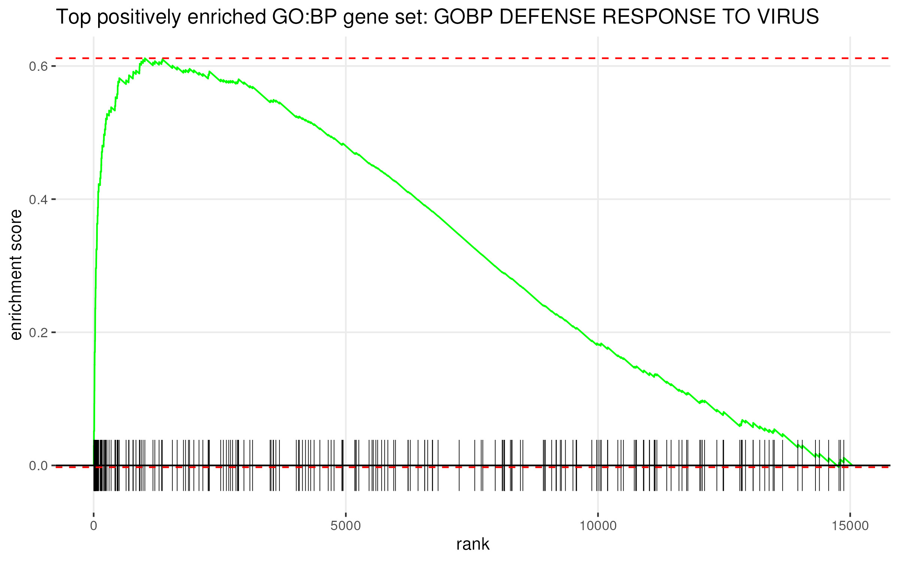
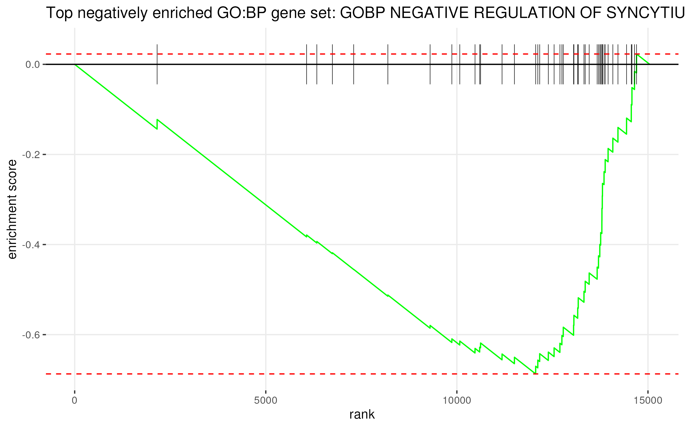
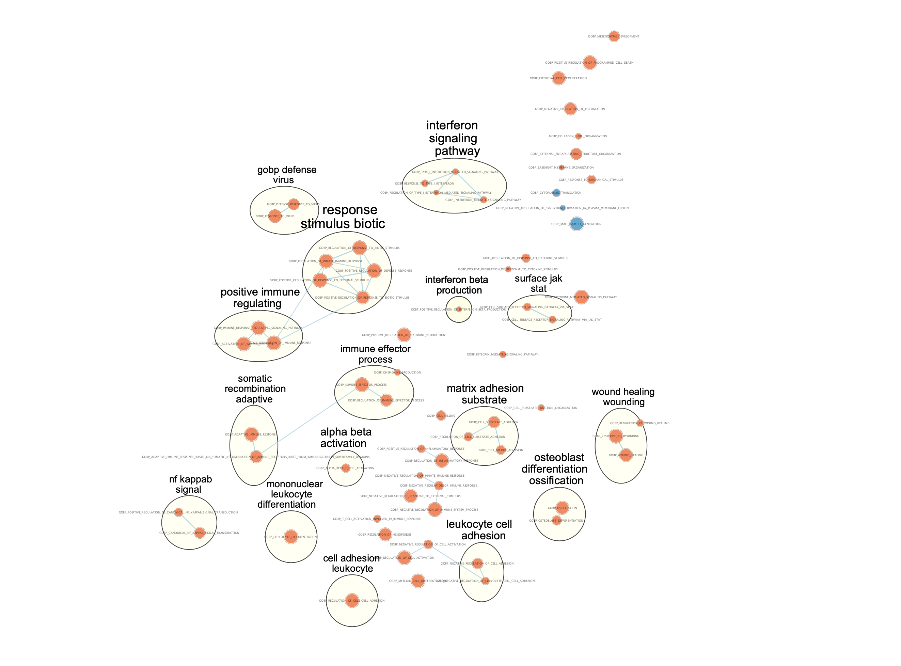

```{r}
if (!requireNamespace("org.Hs.eg.db", quietly = TRUE)) {
  suppressMessages(
    suppressWarnings(
      BiocManager::install("org.Hs.eg.db", ask = FALSE, update = FALSE, quiet = TRUE)
    )
  )
}
suppressMessages(install.packages("msigdbr", dependencies = TRUE, quiet = TRUE))

suppressPackageStartupMessages({
library(GEOquery)
library(AnnotationDbi)
library(org.Hs.eg.db)
library(limma)
library(edgeR)
library(dplyr)
library(msigdbr)
library(fgsea)
library(gprofiler2)
library(ggplot2)
library(knitr)
})
```

# INTRODUCTION

This study investigates transcriptional responses to inflammatory stimulation in human dopaminergic (DA) neurons using RNA-seq data from the Gene Expression Omnibus (GEO) dataset GSE296202. The dataset consists of iPSC-derived DA neuron samples treated with either vehicle (control) or interleukin-6 (IL-6), a cytokine known to mediate inflammatory signaling in the central nervous system.
Raw gene-level count data were obtained programmatically using the GEOquery package to ensure reproducibility. The dataset initially contained approximately 27,000–28,000 genes represented by Entrez gene identifiers. These identifiers were mapped to HGNC gene symbols using the org.Hs.eg.db annotation database (Bioconductor), and duplicated gene symbols were collapsed by summing counts across rows mapping to the same gene. Technical replicates were further collapsed to represent biological samples.

To improve statistical power and reduce noise, lowly expressed genes were filtered by retaining genes with counts per million (CPM) greater than 1 in at least 3 samples. Following filtering, normalization was performed using the trimmed mean of M-values (TMM) method implemented in edgeR to account for differences in library size and RNA composition across samples. Normalized counts were transformed using the voom method (limma), which converts counts to log2-CPM values while modeling the mean–variance relationship. This transformation enables the application of linear modeling for differential expression analysis.

Exploratory data analysis, including multi-dimensional scaling (MDS), revealed that samples clustered strongly by cell line, indicating that donor specific variation is the major source of variability in the dataset. Consistent with the original study, IL-6 treatment did not produce significant differential expression when all samples were analyzed together. However, prior findings reported sex-specific effects, with reduced dopamine release observed specifically in female DA neurons following IL-6 treatment.

Differential expression analysis was restricted to female samples and modeled treatment and cell line as covariates. The resulting ranked gene list was used for over-representation and gene set enrichment analyses to identify transcriptional programs associated with IL-6–induced inflammatory signaling in dopaminergic neurons.

```{r}
invisible(capture.output({
  gse <- getGEO("GSE296202", GSEMatrix = TRUE)
  supp_files <- getGEOSuppFiles("GSE296202", makeDirectory = TRUE)
}))

counts_file <- "GSE296202/GSE296202_raw_counts_all_samples.csv.gz"

raw <- read.csv(
  counts_file,
  header = TRUE,
  stringsAsFactors = FALSE,
  check.names = FALSE
)

entrez_ids <- as.character(raw[[1]])
counts <- as.matrix(raw[, -(1:2)])
rownames(counts) <- entrez_ids
mode(counts) <- "numeric"

# Map Entrez IDs to HGNC gene symbols
map_df <- suppressMessages(
  AnnotationDbi::select(
  org.Hs.eg.db,
  keys = entrez_ids,
  keytype = "ENTREZID",
  columns = c("SYMBOL")
))

symbol_vec <- map_df$SYMBOL[match(entrez_ids, map_df$ENTREZID)]

keep_map <- !is.na(symbol_vec) & symbol_vec != ""
counts_filt <- counts[keep_map, ]
symbols_filt <- symbol_vec[keep_map]

# Collapse duplicated symbols
counts_hgnc <- rowsum(counts_filt, group = symbols_filt)

# Collapse technical replicates into biological samples
base_names <- sub("\\.[ABC]$", "", colnames(counts_hgnc))

counts_bio <- sapply(unique(base_names), function(x) {
  rowSums(counts_hgnc[, base_names == x, drop = FALSE])
})

counts_bio <- as.matrix(counts_bio)
mode(counts_bio) <- "numeric"

# Build sample metadata
samples <- colnames(counts_bio)

pheno_bio <- data.frame(
  sample = samples,
  Sex = factor(ifelse(grepl("^F", samples), "Female", "Male")),
  Line = factor(sub("^[FM]-line([0-9]).*", "\\1", samples)),
  Treatment = factor(ifelse(grepl("IL6", samples), "IL6", "Veh"),
                     levels = c("Veh", "IL6")),
  row.names = samples
)

#kable(pheno_bio, caption = "Sample metadata after collapsing technical replicates.")
```
# differential analysis
## all samples

 edgeR filtering + TMM normalization
```{r}
y_all <- DGEList(counts = counts_bio, samples = pheno_bio)

keep_all <- rowSums(cpm(y_all) > 1) >= 4
y_all <- y_all[keep_all, , keep.lib.sizes = FALSE]

y_all <- calcNormFactors(y_all, method = "TMM")

design_all <- model.matrix(~ Sex + Line + Treatment, data = pheno_bio)

v_all <- voom(y_all, design_all, plot = TRUE)

fit_all <- lmFit(v_all, design_all)
fit_all <- eBayes(fit_all)

res_all <- topTable(
  fit_all,
  coef = "TreatmentIL6",
  number = Inf,
  sort.by = "P"
)

res_all$gene <- rownames(res_all)
res_all_tbl <- as.data.frame(res_all)


cat("All-samples: raw p < 0.05 =", sum(res_all_tbl$P.Value < 0.05), "\n")


```

## female samples
```{r}
idx_f <- pheno_bio$Sex == "Female"

counts_f <- counts_bio[, idx_f, drop = FALSE]
pheno_f <- pheno_bio[idx_f, , drop = FALSE]

# Build female-only DGEList
y_f <- DGEList(counts = counts_f, samples = pheno_f)

# Filter within females only
keep_f <- rowSums(cpm(y_f) > 1) >= 3
y_f <- y_f[keep_f, , keep.lib.sizes = FALSE]

# Recompute normalization on female-only set
y_f <- calcNormFactors(y_f, method = "TMM")

# Female-only design
design_f <- model.matrix(~ Line + Treatment, data = pheno_f)

# voom + limma
v_f <- voom(y_f, design_f, plot = TRUE)

fit_f <- lmFit(v_f, design_f)
fit_f <- eBayes(fit_f)

res_f <- topTable(
  fit_f,
  coef = "TreatmentIL6",
  number = Inf,
  sort.by = "P"
)

res_f$gene <- rownames(res_f)
res_f_tbl <- as.data.frame(res_f)

cat("Raw p < 0.05:", sum(res_f_tbl$P.Value < 0.05), "\n")
cat("FDR < 0.05:", sum(res_f_tbl$adj.P.Val < 0.05), "\n")
cat("FDR < 0.05 & |log2FC| > 1:",
    sum(res_f_tbl$adj.P.Val < 0.05 & abs(res_f_tbl$logFC) > 1), "\n")


#defining gene lists

up_genes <- res_f_tbl %>%
  filter(P.Value < 0.05, logFC > 0.5) %>%
  pull(gene)

down_genes <- res_f_tbl %>%
  filter(P.Value < 0.05, logFC < 0) %>%
  pull(gene)

all_nominal_genes <- res_f_tbl %>%
  filter(P.Value < 0.05) %>%
  pull(gene)

cat("Up-regulated genes for ORA:", length(up_genes), "\n")
cat("Down-regulated genes for ORA:", length(down_genes), "\n")
cat("All nominally significant genes:", length(all_nominal_genes), "\n")


kable(
  head(res_f_tbl[, c("gene", "logFC", "P.Value", "adj.P.Val")], 15),
  row.names = FALSE,
  caption = "Top female-only differential expression results ranked by nominal p-value."
)

```


# Thresholded gene set enrichment analysis

## Define significant gene sets

 
Thresholded enrichment was performed using over representation analysis (ORA) with the gost() function from gprofiler2. ORA was chosen because it is appropriate for thresholded lists of significantly differentially expressed genes, where the goal is to test whether known gene sets are represented more often than expected by chance among the selected genes.
For annotation, Gene sets were defined using Gene Ontology Biological Process (GO:BP) terms through g:Profiler. GO:BP was chosen because it is well suited for interpreting functional biological responses to IL-6 treatment. 
Differentially expressed genes were defined using a nominal p-value threshold of p < 0.05, as no genes passed multiple testing correction (FDR < 0.05). Genes were further separated into up-regulated and down-regulated sets based on the sign of the log2 fold change.

The analysis was performed using the following package versions:
- gprofiler2: `r as.character(packageVersion("gprofiler2"))`
- fgsea: `r as.character(packageVersion("fgsea"))`
- msigdbr: `r as.character(packageVersion("msigdbr"))`


```{r}

#Thresholded gene set enrichment analysis

gost_up <- gost(
  query = up_genes,
  organism = "hsapiens",
  correction_method = "fdr",
  sources = c("GO:BP")
)

gost_down <- gost(
  query = down_genes,
  organism = "hsapiens",
  correction_method = "fdr",
  sources = c("GO:BP", "GO:MF", "GO:CC")
)

gost_all <- gost(
  query = all_nominal_genes,
  organism = "hsapiens",
  correction_method = "fdr",
  sources = c("GO:BP")
)

ora_up_tbl <- if (!is.null(gost_up) && !is.null(gost_up$result)) gost_up$result else data.frame()
ora_down_tbl <- if (!is.null(gost_down) && !is.null(gost_down$result)) gost_down$result else data.frame()
ora_all_tbl <- if (!is.null(gost_all) && !is.null(gost_all$result)) gost_all$result else data.frame()

ora_up_sig <- ora_up_tbl %>%
  filter(p_value < 0.05) %>%
  arrange(p_value)

ora_down_sig <- ora_down_tbl %>%
  filter(p_value < 0.05) %>%
  arrange(p_value)

ora_all_sig <- ora_all_tbl %>%
  filter(p_value < 0.05) %>%
  arrange(p_value)

cat("Significant GO:BP terms from up-regulated genes:", nrow(ora_up_sig), "\n")
cat("Significant GO:BP terms from down-regulated genes:", nrow(ora_down_sig), "\n")
cat("Significant GO:BP terms from all nominally significant genes:", nrow(ora_all_sig), "\n")


#ora result tables


head(ora_up_sig[, c("term_name", "p_value", "intersection_size")])
head(ora_down_sig[, c("term_name", "p_value", "intersection_size")])

ora_up_top <- ora_up_sig %>%
  select(term_name, p_value, intersection_size, term_size) %>%
  head(10)

ora_down_top <- ora_down_sig %>%
  select(term_name, p_value, intersection_size, term_size) %>%
  head(10)

kable(
  ora_up_top,
  caption = "Table 1. Top 10 enriched GO Biological Process terms from the up-regulated female-only gene set."
)

kable(
  ora_down_top,
  caption = "Table 2. Top 10 enriched GO Biological Process terms from the down-regulated female-only gene set."
)

```
## ora plots
```{r, fig.width=12, fig.height=8}

# ORA plots
if (!dir.exists("figures")) {
  dir.create("figures", recursive = TRUE)
}

if (nrow(ora_up_sig) > 0) {
  ora_up_plot <- ora_up_sig %>%
    select(term_name, p_value, intersection_size, term_size) %>%
    head(10)

  ora_up_plot$p_value[ora_up_plot$p_value == 0] <- 1e-300
  ora_up_plot$term_name <- factor(ora_up_plot$term_name, levels = rev(ora_up_plot$term_name))

  p_up <- ggplot(ora_up_plot, aes(x = reorder(term_name, p_value), y = -log10(p_value))) +
  geom_col() +
  coord_flip() +
  labs(
    title = "Top enriched GO Biological Process terms: up-regulated genes",
    x = "GO term",
    y = expression(-log[10](p))
  ) +
  theme_minimal(base_size = 12)

  print(p_up)
}

if (nrow(ora_down_sig) > 0) {
  ora_down_plot <- ora_down_sig %>%
    select(term_name, p_value, intersection_size, term_size) %>%
    head(10)

  ora_down_plot$p_value[ora_down_plot$p_value == 0] <- 1e-300
  ora_down_plot$term_name <- factor(ora_down_plot$term_name, levels = rev(ora_down_plot$term_name))

 p_down <- ggplot(ora_down_plot, aes(x = reorder(term_name, p_value), y = -log10(p_value))) +
  geom_col() +
  coord_flip() +
  labs(
    title = "Top enriched GO Biological Process terms: down-regulated genes",
    x = "GO term",
    y = expression(-log[10](p))
  ) +
  theme_minimal(base_size = 12)
 
  print(p_down)
}


```


### Thresholded analysis summary and discussion

The up-regulated gene set showed strong enrichment for immune-related biological processes, including defense response to virus, innate immune response, and response to external stimulus. These results indicate activation of inflammatory and interferon-like signaling pathways in response to IL-6 treatment.
In contrast, the down-regulated gene set produced far fewer enriched pathways and was primarily associated with structural and cellular processes, including muscle system processes, extracellular organization, and ion channel complexes. This suggests suppression of normal cellular maintenance and structural functions.
Separating up-regulated and down-regulated genes preserves the direction of the response to IL-6 treatment, enabling clearer biological interpretation. Up-regulated genes reflect processes activated by treatment, whereas down-regulated genes highlight suppressed cellular functions.

These results are consistent with the conclusions of the original GSE296202 study, which reported that IL-6 induces stronger inflammatory responses in female dopaminergic neurons, accompanied by reduced neuronal firing, altered synaptic vesicle dynamics, and decreased dopamine release (Huang et al., 2026). These functional impairments were linked to activation of inflammatory transcriptional programs following IL-6 exposure.
The enrichment of immune and antiviral pathways observed in the up-regulated gene set, including defense response to virus, innate immune response, and interferon-related processes, supports this model of IL-6 induced inflammatory activation. Notably, many of the top differentially expressed genes identified in this analysis such as IFITM1, IFI44, ISG15, GBP1 are well-characterized interferon stimulated genes, suggesting that IL-6 treatment induces a transcriptional state resembling an antiviral or type I interferon response (Tanaka et al., 2014).

Mechanistically, IL-6 signaling is known to act through the JAK/STAT pathway, leading to activation of STAT transcription factors and downstream induction of inflammatory and immune-related genes (Hu et al., 2021). The presence of JAK/STAT-related and immune effector pathways in both ORA and GSEA results further supports the conclusion that IL-6 drives a coordinated inflammatory transcriptional program in these cells.

This interpretation is further supported by the broader literature, where neuroinflammation has been shown to directly impact dopaminergic neuron function. Inflammatory cytokines, including IL-6, have been reported to alter neuronal excitability, synaptic transmission, and dopamine signaling, contributing to functional impairments in dopaminergic systems. Chronic or elevated inflammatory signaling has also been implicated in dopaminergic neuron vulnerability and degeneration, particularly in neurodegenerative diseases such as Parkinson’s disease (Castillo-Rangel et al., 2023).

Several down-regulated pathways were related to muscle function and ion channel activity, including muscle system process, striated muscle contraction, skeletal muscle contraction, and inward rectifier potassium channel complex. Although these pathways are not specific to dopaminergic neurons, they may reflect broader alterations in cellular excitability and functional output. These findings are consistent with literature linking inflammation to motor related symptoms in depression. The observed down-regulation of muscle and contraction related processes may reflect transcriptional changes associated with impaired neuronal activity and motor-related function in the context of inflammation. This suggests that IL-6 induced inflammatory signaling may contribute not only to immune activation but also to functional suppression of neuronal processes relevant to motor behavior (Song et al., 1999).

Inflammation-related transcriptional changes in dopaminergic circuits have been linked to behavioral and functional outcomes, including reduced motivation, fatigue, and psychomotor slowing (Capellino et al., 2014). Together, these findings suggest that the transcriptional signatures observed in this analysis reflect a broader shift toward an inflammatory, functionally impaired neuronal state induced by IL-6 exposure.

A key limitation is that no genes passed FDR < 0.05 in the differential expression analysis, meaning the ORA results should be interpreted as exploratory. However, the convergence of many nominally significant genes on coherent immune related pathways supports the biological relevance of the observed signal, particularly given its consistency with both the original study and established IL-6 signaling mechanisms.


# Non-thresholded gene set enrichment analysis
## Method and genesets
For non-thresholded enrichment, I used Gene Set Enrichment Analysis (GSEA) with the fgsea package. This method was chosen because it analyzes the entire ranked gene list, rather than requiring an arbitrary significance cutoff. This allows detection of coordinated pathway-level changes even when many individual genes do not pass the differential expression threshold.
Genes were ranked using the moderated t-statistic derived from the limma linear model, which incorporates both effect size and variance stabilization. This ranking metric preserves both the direction and strength of differential expression and is appropriate for enrichment analysis. Gene sets were obtained from the Molecular Signatures Database (MSigDB) using the `msigdbr` package, specifically the C5 Gene Ontology Biological Process (GO:BP) collection for Homo sapiens. The GO:BP collection was chosen because it provides detailed coverage of biological processes and is well suited for interpreting transcriptional responses to inflammatory stimuli such as IL-6. 
This approach complements thresholded over-representation analysis by capturing pathway-level changes and biological signals across the full gene list.


```{r}
#ranked list and fgsea

rank_tbl <- res_f_tbl %>%
  select(gene, t) %>%
  filter(!is.na(gene), !is.na(t)) %>%
  group_by(gene) %>%
  slice_max(order_by = abs(t), n = 1, with_ties = FALSE) %>%
  ungroup()

gene_ranks <- rank_tbl$t
names(gene_ranks) <- rank_tbl$gene
gene_ranks <- sort(gene_ranks, decreasing = TRUE)

msig_h <- msigdbr(
  species = "Homo sapiens",
  collection = "C5",
  subcollection = "BP"
)

pathways <- split(msig_h$gene_symbol, msig_h$gs_name)

fgsea_res <- fgseaMultilevel(
  pathways = pathways,
  stats = gene_ranks,
  minSize = 15,
  maxSize = 500
)

fgsea_res <- fgsea_res[order(fgsea_res$padj), ]

fgsea_sig <- fgsea_res %>%
  filter(padj < 0.05)

fgsea_pos <- fgsea_sig %>%
  filter(NES > 0) %>%
  arrange(desc(NES))

fgsea_neg <- fgsea_sig %>%
  filter(NES < 0) %>%
  arrange(NES)

cat("Significant GO Biological Process (C5:BP) gene sets from GSEA:", nrow(fgsea_sig), "\n")
cat("Positively enriched gene sets (NES > 0):", nrow(fgsea_pos), "\n")
cat("Negatively enriched gene sets (NES < 0):", nrow(fgsea_neg), "\n")
```

```{r}

fgsea_top_pos <- fgsea_pos %>%
  select(pathway, NES, pval, padj, size) %>%
  head(10)

fgsea_top_neg <- fgsea_neg %>%
  select(pathway, NES, pval, padj, size) %>%
  head(10)


kable(
  fgsea_top_pos,
  caption = "Table 4. Top positively enriched Gene Ontology Biological Process (GO:BP) gene sets identified by GSEA using a t-statistic-ranked gene list (MSigDB C5 collection; FDR < 0.05)."
)

kable(
  fgsea_top_neg,
  caption = "Table 5. Top negatively enriched Gene Ontology Biological Process (GO:BP) gene sets identified by GSEA using a t-statistic-ranked gene list (MSigDB C5 collection; FDR < 0.05)."
)


```
## FGSEA plot

```{r, fig.width=12, fig.height=8}
fgsea_top_plot <- rbind(
  fgsea_top_pos[, c("pathway", "NES", "padj")],
  fgsea_top_neg[, c("pathway", "NES", "padj")]
)

fgsea_top_plot$pathway <- factor(
  fgsea_top_plot$pathway,
  levels = fgsea_top_plot$pathway[order(fgsea_top_plot$NES)]
)

p_gsea <- ggplot(fgsea_top_plot, aes(x = pathway, y = NES, fill = NES)) +
  geom_col() +
  coord_flip() +
  scale_fill_gradient2(low = "blue", mid = "white", high = "red") +
  labs(
    title = "Top enriched GO Biological Process (C5:BP) gene sets from GSEA",
    x = "GO Biological Process gene set",
    y = "Normalized enrichment score (NES)",
    fill = "NES"
  )

ggsave(
  "figures/gsea_c5bp_top_terms.png",
  plot = p_gsea,
  width = 12,
  height = 9
)



```

```{r}
clean_name <- function(x) {
  gsub("_", " ", gsub("^GO_", "", x))
}


if (nrow(fgsea_pos) > 0) {
  top_pos_pathway <- fgsea_pos$pathway[which.max(fgsea_pos$NES)]
  
  p_pos <- plotEnrichment(pathways[[top_pos_pathway]], gene_ranks) +
    labs(
    title = paste("Top positively enriched GO:BP gene set:", clean_name(top_pos_pathway))
  )
  
  ggsave(
    "figures/gsea_c5bp_top_positive_enrichment.png",
    plot = p_pos,
    width = 8,
    height = 5
  )
  
  
}

if (nrow(fgsea_neg) > 0) {
  top_neg_pathway <- fgsea_neg$pathway[which.min(fgsea_neg$NES)]
  
  p_neg <- plotEnrichment(pathways[[top_neg_pathway]], gene_ranks) +
    labs(
      title = paste("Top negatively enriched GO:BP gene set:", clean_name(top_neg_pathway))
    )
  
  ggsave(
    "figures/gsea_c5bp_top_negative_enrichment.png",
    plot = p_neg,
    width = 8,
    height = 5
  )
  
  
}

```

## Non-thresholded analysis summary and comparison to thresholded analysis

Non-thresholded GSEA identified `r nrow(fgsea_sig)` significant GO Biological Process (C5:BP) gene sets at FDR < 0.05, including `r nrow(fgsea_pos)` positively enriched pathways and `r nrow(fgsea_neg)` negatively enriched pathways. Because GSEA uses the full ranked gene list, it is able to detect coordinated pathway-level changes even when many individual genes do not pass the significance threshold used in ORA.

The positively enriched pathways were dominated by immune and inflammatory processes, including defense response to virus, interferon signaling, and innate immune response. In contrast, negatively enriched pathways were fewer and primarily related to cellular structure and maintenance processes, such as cilium organization and intracellular transport. These results are consistent with the ORA findings, which also highlighted strong enrichment of immune-related pathways among up-regulated genes.

Qualitative comparison between GSEA and thresholded ORA should be interpreted cautiously, as the two approaches address different questions. ORA evaluates whether predefined pathways are over-represented among genes that pass a significance cutoff, whereas GSEA assesses whether genes from a pathway are systematically enriched at the top or bottom of the full ranked list without requiring a threshold.

In this analysis, both methods used GO Biological Process gene sets, making comparison more direct than if different annotation sources were used. However, GO:BP is inherently redundant, and GSEA returned a large number of overlapping pathways (`r nrow(fgsea_sig)`), reflecting shared gene membership across related biological processes. As a result, interpretation is more reliable at the level of broader biological themes rather than individual pathway names.

Overall, the two approaches provide complementary insights. ORA highlights strongly differentially expressed processes, while GSEA captures more subtle but coordinated transcriptional shifts. In this dataset, both methods consistently indicate that IL-6 treatment induces a robust inflammatory and interferon-like response in female dopaminergic neurons, alongside suppression of cellular structural processes.


the following code creates the files required to upload onto cytoscape:
```{r}
rank_tbl <- data.frame(
  gene = names(gene_ranks),
  rank = as.numeric(gene_ranks)
)

if (file.exists("ranked_gene_list.rnk")) {
  file.remove("ranked_gene_list.rnk")
}

write.table(
  rank_tbl,
  file = "ranked_gene_list.rnk",
  sep = "\t",
  quote = FALSE,
  row.names = FALSE,
  col.names = FALSE
)


fgsea_em <- fgsea_res %>%
  transmute(
    pathway_id = pathway,
    pathway_name = pathway,
    pvalue = pval,
    fdr = padj,
    phenotype = ifelse(NES > 0, 1, -1),
    genes = vapply(leadingEdge, function(x) paste(x, collapse = ","), character(1))
  )

if (file.exists("fgsea_c5bp_em_results.tsv")) {
  file.remove("fgsea_c5bp_em_results.tsv")
}

write.table(
  fgsea_em,
  file = "fgsea_c5bp_em_results.tsv",
  sep = "\t",
  quote = FALSE,
  row.names = FALSE
)


msig_c5bp <- msigdbr(
  species = "Homo sapiens",
  collection = "C5",
  subcollection = "BP"
)

gmt_tbl <- msig_c5bp %>%
  select(gs_name, gs_description, gene_symbol)

gmt_list <- split(gmt_tbl$gene_symbol, gmt_tbl$gs_name)
gmt_desc <- gmt_tbl %>%
  distinct(gs_name, gs_description)

write_gmt <- function(pathways, descriptions, file) {
  con <- file(file, open = "wt")
  on.exit(close(con))
  
  for (nm in names(pathways)) {
    desc <- descriptions$gs_description[match(nm, descriptions$gs_name)]
    if (is.na(desc) || length(desc) == 0) desc <- ""
    line <- c(nm, desc, pathways[[nm]])
    writeLines(paste(line, collapse = "\t"), con)
  }
}

if (file.exists("msigdb_c5bp.gmt")) file.remove("msigdb_c5bp.gmt")
write_gmt(gmt_list, gmt_desc, "msigdb_c5bp.gmt")


fgsea_pos_export <- fgsea_res %>%
  filter(NES > 0) %>%
  transmute(
    pathway = pathway,
    pvalue = pval,
    FDR = padj
  )

fgsea_neg_export <- fgsea_res %>%
  filter(NES < 0) %>%
  transmute(
    pathway = pathway,
    pvalue = pval,
    FDR = padj
  )

write.table(fgsea_pos_export, "fgsea_pos.tsv", sep="\t", quote=FALSE, row.names=FALSE)
write.table(fgsea_neg_export, "fgsea_neg.tsv", sep="\t", quote=FALSE, row.names=FALSE)

```

# Cytoscape
here is the generated cytoscape enrichment map:
```{r echo=FALSE, fig.align="center", out.width="90%", fig.cap="Figure 1. Annotated enrichment map of GSEA results visualized in Cytoscape."}

```
Gene set enrichment results from GSEA were visualized using Cytoscape with the EnrichmentMap plugin. The enrichment map was constructed using the following parameters:

- FDR (q-value) cutoff: 0.0001  
- Similarity metric: Combined coefficient  
- Similarity cutoff: 0.67  

The resulting network contained about 100 nodes and 200 edges howeveer in the figure i am showing about 50 of the most significant nodes. Each node represents a GO Biological Process gene set and each edge represents gene overlap between pathways.

### Network Annotation and Thematic Clustering

The network was annotated using the AutoAnnotate plugin in Cytoscape with default parameters. Clusters were identified based on pathway similarity and manually arranged to improve interpretability.

Several major biological themes were observed:

1. **Interferon and antiviral response (dominant cluster)**  
   This cluster includes pathways such as interferon signaling, defense response to virus, and response to virus. It represents the strongest enrichment signal and reflects activation of an antiviral, interferon-mediated transcriptional program.

2. **JAK/STAT signaling (surface JAK/STAT cluster)**  
   A distinct cluster centered on JAK/STAT-related pathways was observed, consistent with the known mechanism of IL-6 signaling. IL-6 activates downstream transcription through the JAK/STAT pathway, linking cytokine signaling to the observed immune gene expression changes.

3. **Immune effector and immune regulation processes**  
   Clusters including immune effector process and positive regulation of immune response indicate activation of downstream immune functions, suggesting that IL-6 not only initiates signaling but also drives broader immune activation programs.

4. **Leukocyte and cell interaction processes**  
   Pathways such as leukocyte differentiation and cell adhesion highlight processes related to immune cell behavior and intercellular communication, which are commonly associated with inflammatory responses.

5. **Wound healing and extracellular processes**  
   A cluster including wound healing, matrix adhesion, and extracellular organization suggests remodeling of cellular interactions and tissue-related processes, which may occur as part of a broader inflammatory or stress response.

---

### Interpretation

The enrichment map reveals a structured and highly interconnected network dominated by immune and inflammatory processes. In particular, the presence of a JAK/STAT-centered cluster provides mechanistic support for IL-6 signaling activity, while the interferon and antiviral clusters indicate downstream activation of immune transcriptional programs.
The identification of immune effector, regulatory, and wound healing pathways suggests that IL-6 induces not only signaling responses but also broader functional changes in cellular behavior. These results are consistent with both ORA and GSEA findings and support a model in which IL-6 drives a coordinated inflammatory response in female dopaminergic neurons. Although GO:BP annotations can be redundant and result in overlapping clusters, the major biological themes remain clear and biologically coherent.


# References

Capellino, S., Cosentino, M., Luini, A., Bombelli, R., Lowin, T., Cutolo, M., Marino, F. and Straub, R.H. (2014), Increased Expression of Dopamine Receptors in Synovial Fibroblasts From Patients With Rheumatoid Arthritis: Inhibitory Effects of Dopamine on Interleukin-8 and Interleukin-6. Arthritis & Rheumatology, 66: 2685-2693. https://doi.org/10.1002/art.38746

Castillo-Rangel C, Marin G, Hernández-Contreras KA, Vichi-Ramírez MM, Zarate-Calderon C, Torres-Pineda O, Diaz-Chiguer DL, De la Mora González D, Gómez Apo E, Teco-Cortes JA, Santos-Paez FM, Coello-Torres MLÁ, Baldoncini M, Reyes Soto G, Aranda-Abreu GE, García LI. Neuroinflammation in Parkinson's Disease: From Gene to Clinic: A Systematic Review. Int J Mol Sci. 2023 Mar 17;24(6):5792. doi: 10.3390/ijms24065792. PMID: 36982866; PMCID: PMC10051221.

Emmons, H. A., Wallace, C. W., & Fordahl, S. C. (2023). Interleukin-6 and tumor necrosis factor-α attenuate dopamine release in mice fed a high-fat diet, but not medium or low-fat diets. Nutritional Neuroscience, 26(9), 864–874. https://doi.org/10.1080/1028415X.2022.2103613

Geistlinger L, Csaba G, Santarelli M, Ramos M, Schiffer L, Turaga N, Law C, Davis S, Carey V, Morgan M, Zimmer R, Waldron L. Toward a gold standard for benchmarking gene set enrichment analysis. Brief Bioinform. 2021 Jan 18;22(1):545-556. doi: 10.1093/bib/bbz158. PMID: 32026945; PMCID: PMC7820859.

Huang, Y., Michalski, C., Zhou, Y. et al. Synaptic effects of interleukin-6 on human iPSC-derived dopaminergic neurons. Neuropsychopharmacol. 51, 934–945 (2026). https://doi.org/10.1038/s41386-025-02320-y

Hu, X., li, J., Fu, M. et al. The JAK/STAT signaling pathway: from bench to clinic. Sig Transduct Target Ther 6, 402 (2021). https://doi.org/10.1038/s41392-021-00791-1

Song, C. Merali, Z. Anisman, H. Variations of nucleus accumbens dopamine and serotonin following systemic interleukin-1, interleukin-2 or interleukin-6 treatment,
Neuroscience, Volume 88, Issue 3, 1999,Pages 823-836,ISSN 0306-4522,https://doi.org/10.1016/S0306-4522(98)00271-1.

Tanaka T, Narazaki M, Kishimoto T. IL-6 in inflammation, immunity, and disease. Cold Spring Harb Perspect Biol. 2014 Sep 4;6(10):a016295. doi: 10.1101/cshperspect.a016295. PMID: 25190079; PMCID: PMC4176007.

Tansey MG, Goldberg MS. Neuroinflammation in Parkinson's disease: its role in neuronal death and implications for therapeutic intervention. Neurobiol Dis. 2010 Mar;37(3):510-8. doi: 10.1016/j.nbd.2009.11.004. Epub 2009 Nov 10. PMID: 19913097; PMCID: PMC2823829.

